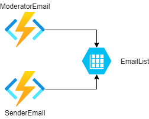
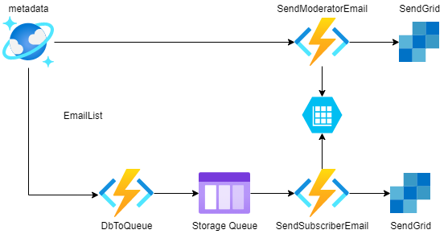

## AI For Orcas - Notification System

The notification system is a set of azure functions responsible for:
- Facilitating adding/removing moderators and subscribers
- Identifying changes in the database and sending alerts

## Architecture



There are two Azure Functions that update the email list.

- ModeratorEmail is a REST API that writes to the email list
- SenderEmail is a REST API that writes to the email list
- Email list is implemented using Azure Tables, using either "Moderator" or "Subscriber" as the partition key



There are three other Azure Functions that make up the email notification system.

In the moderators flow:

- A change in the Cosmos DB metadata store triggers the SendModeratorEmail function
- If there is a newly detected orca call that requires a moderator to validate, the function fetches the relevant email list
- The function then calls SendGrid to send emails to moderators

In the subscribers flow:

- A change in the Cosmos DB metadata store triggers the DbToQueue function
- If there is a new orca call that the moderator has validated, the function sends a message to a queue
- The SendSubscriberEmail function periodically checks the queue
- If there are items in the queue, the function fetches the relevant email list
- The function then calls SendGrid to send emails to subscribers

## Prerequisites

- Access to the [Orca Conservancy azure subscription](https://portal.azure.com/#@b8a2e287-987e-47a2-8253-26017d3bef2c/resource/subscriptions/9ffa543e-3596-43aa-b82c-8f41dfbf03cc/resourceGroups)
- Install the [.net core 3.1 runtime and SDK](https://dotnet.microsoft.com/download/dotnet-core/3.1)
- If running locally - [Azure storage emulator](https://docs.microsoft.com/en-us/azure/storage/common/storage-use-emulator)

## Build 
To build the functions locally:

1. Go to /NotificationSystem directory (if not already)
2. If building from the command line, run 
    ```
    dotnet build NotificationSystem.csproj
    ```
3. If building from visual studio, simply open .csproj and build as normal

## Azure Resource Dependencies
All resources are located in resource group **LiveSRKWNotificationSystem**.

1. Storage account with queues, email template images and moderator/subscriber list: [orcanotificationstorage](https://portal.azure.com/#@b8a2e287-987e-47a2-8253-26017d3bef2c/resource/subscriptions/9ffa543e-3596-43aa-b82c-8f41dfbf03cc/resourceGroups/LiveSRKWNotificationSystem/providers/Microsoft.Storage/storageAccounts/orcanotificationstorage/overview)
2. Metadata store (from which some functions are triggered): [aifororcasmetadatastore](https://portal.azure.com/#@b8a2e287-987e-47a2-8253-26017d3bef2c/resource/subscriptions/9ffa543e-3596-43aa-b82c-8f41dfbf03cc/resourceGroups/LiveSRKWNotificationSystem/providers/Microsoft.DocumentDb/databaseAccounts/aifororcasmetadatastore/overview)
3. Azure function app: [orcanotification](https://portal.azure.com/#@b8a2e287-987e-47a2-8253-26017d3bef2c/resource/subscriptions/9ffa543e-3596-43aa-b82c-8f41dfbf03cc/resourceGroups/LiveSRKWNotificationSystem/providers/Microsoft.Web/sites/orcanotification/appServices)
4. SendGrid account (for sending emails): **TODO: Needs to be recreated since credentials were lost** [aifororcas](https://portal.azure.com/#@b8a2e287-987e-47a2-8253-26017d3bef2c/resource/subscriptions/9ffa543e-3596-43aa-b82c-8f41dfbf03cc/resourceGroups/LiveSRKWNotificationSystem/providers/Sendgrid.Email/accounts/aifororcas/overview)

## Run Locally
It is recommended to go to the "orcanotification" function app, then Settings > Configuration to find the app settings used. 

1. Create a local.settings.json file with the settings found in the function app. See [documentation](https://docs.microsoft.com/en-us/azure/azure-functions/functions-run-local?tabs=windows%2Ccsharp%2Cbash#local-settings-file) here.
    - Set all connection strings to be "UseDevelopmentStorage=true"
2. You also need to start the azure storage emulator if you aren't using real connection strings. 

## Run on Azure

1. Go to the "orcanotification" function app (link 3 above). 
2. On the "Overview" tab, make sure the status of the function shows running.
3. On the "Functions" tab, you should see all the functions of the notification system. Enable/Disable as needed. 